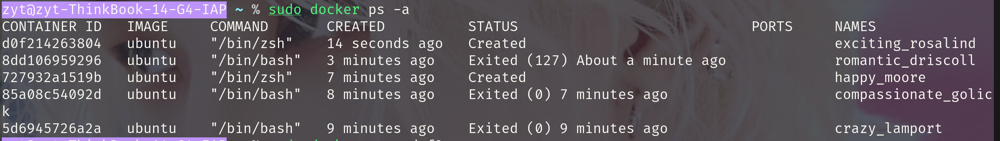

[务必点这里](https://www.runoob.com/docker/docker-ps-command.html)

阉割版如下

## 安装

使用官方安装脚本自动安装，安装命令如下：

```
 curl -fsSL https://test.docker.com -o test-docker.sh
 sudo sh test-docker.sh
```

(若出现 `permision denied` 则加上 `sudo` 或切到 `root` 用户，以下同理)

## 使用

### 获取镜像

如果我们本地没有 ubuntu 镜像，我们可以使用 docker pull 命令来载入 ubuntu 镜像：

```
$ docker pull ubuntu
```

### 启动容器

以下命令使用  ubuntu 镜像创建并启动一个容器，参数为以命令行模式进入该容器：

```
$ docker run -it ubuntu /bin/bash
```

退出只需输入 `exit` 即可

### 查看已有容器：

```
sudo docker ps -a
```



### 切换容器

```
sudo docker exec -it 8dd106959296 /bin/bash
```

`exec`+`[option]`+`ID`+`[tty]`

可能会返回报错说容器未打开，可以使用——

### 打开容器

```
sudo docker start 8dd106959296
```

`start`+`ID`

打开后再进行切换即可
