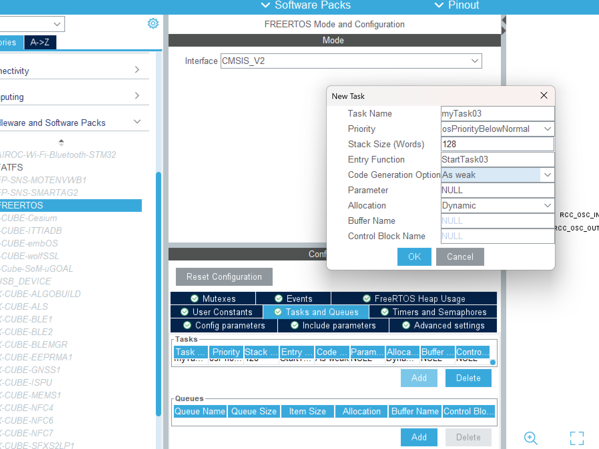
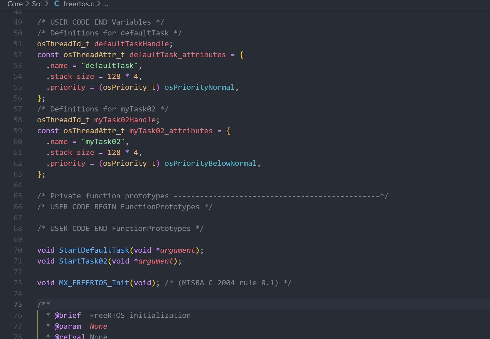
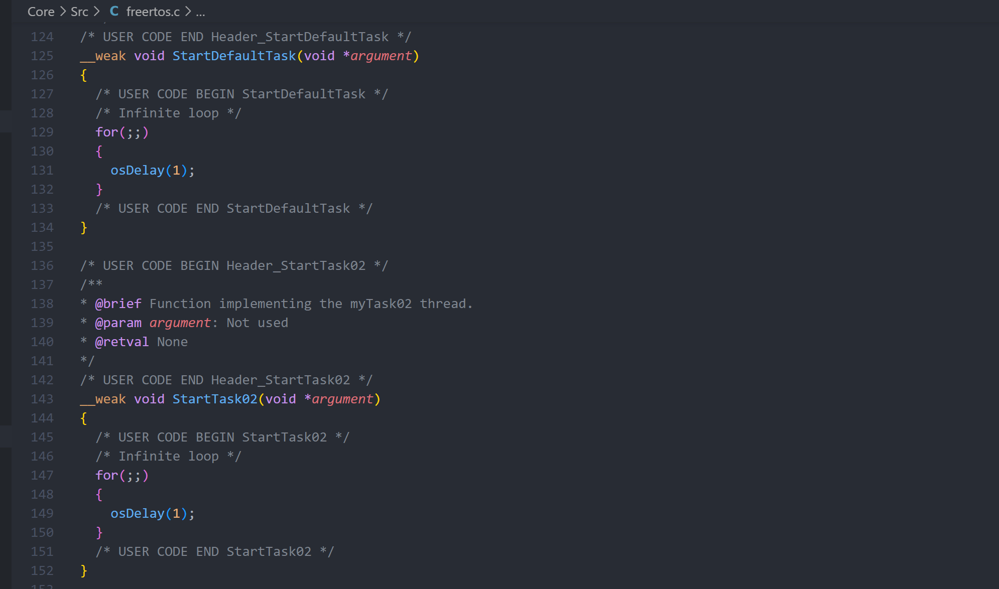

# Cube

创建任务可以在cube中直接点击Tasks处的Add，然后一般修改名字，Priority和Code Generation Option

* Priority：任务优先级，从上至下优先级越来越高。（数值越高优先级越高）
* Stack Size：任务的栈的大小，默认给的数值一般不会不够用，可以不用改
* Entry Function：入口函数名
* Code Generation Option：函数定义方式（一般，弱，外部）
* Parameter：参数
* Alloction：任务创建方式：动态/静态

> 创建任务的时候需要给任务指定堆栈，如果使用的函数 xTaskCreate()创建任务(动态方法)的话那么任务堆栈就会由函数 xTaskCreate()自动创建。如果使用函数 xTaskCreateStatic()创建任务(静态方法)的话就需要程序员自行定义任务堆栈，然后堆栈首地址作为函数的参数 puxStackBuffer 传递给函数。原文-->[CSDN](https://blog.csdn.net/qq_44318582/article/details/120153001)



注意task中有一个默认的default Task，可以将其修改为弱定义，以便在另外的文件夹复写，从而避免修改cube自动生成的文件。

# 代码

然后在freertos.c中就会自动生成：



> 创建任务句柄；根据cube选项卡创建任务参数的结构体^

以及



然后就可以直接在上图的任务函数中敲执行代码了！

这里注意一下如果是像cyt靴长一样使用弱定义，可以另建User文件夹来复写任务函数；是Default的话就直接在freertos.c中写。main不需要自行添加与freertos有关的东西！（当然如果用了其他外设什么的一些初始化函数还是需要在main里写的）

---

# 关于API

（借鉴[知乎](https://zhuanlan.zhihu.com/p/514869870)）

在这个版本中创建函数使用的是**osThreadNew()**函数

```
/* creation of defaultTask */  defaultTaskHandle=osThreadNew(StartDefaultTask,NULL,&defaultTask_attributes);
/* creation of myTask02 */  
myTask02Handle=osThreadNew(StartTask02,NULL,&myTask02_attributes);

//这几句在freertos.c的void MX_FREERTOS_Init(void)中
```

下为该函数的定义：

```
osThreadId_t osThreadNew (osThreadFunc_t func, void *argument, const osThreadAttr_t *attr)
 {
  /*创建变量*/
  char empty;
  const char *name;
  uint32_t stack;
  TaskHandle_t hTask;
  UBaseType_t prio;
  int32_t mem;		//mem是与静态和动态的选择有关的标志变量
  
  /*初始化变量*/
  hTask = NULL;

  if (!IS_IRQ() && (func != NULL)) {
    stack = configMINIMAL_STACK_SIZE;
    prio  = (UBaseType_t)osPriorityNormal;

    empty = '\0';
    name  = &empty ;
    mem   = -1;

  /*将结构体attr中的值对应赋给变量，并传入xTaskCreate函数中*/
    if (attr != NULL) {
      if (attr->name != NULL) {
        name = attr->name;
      }
      if (attr->priority != osPriorityNone) {
        prio = (UBaseType_t)attr->priority;
      }

      if ((prio < osPriorityIdle) || (prio > osPriorityISR) || ((attr->attr_bits & osThreadJoinable) == osThreadJoinable)) {
        return (NULL);
      }

      if (attr->stack_size > 0U) {
        /* In FreeRTOS stack is not in bytes, but in sizeof(StackType_t) which is 4 on ARM ports.       */
        /* Stack size should be therefore 4 byte aligned in order to avoid division caused side effects */
        stack = attr->stack_size / sizeof(StackType_t);
      }

      if ((attr->cb_mem    != NULL) && (attr->cb_size    >= sizeof(StaticTask_t)) &&
          (attr->stack_mem != NULL) && (attr->stack_size >  0U)) {
        mem = 1;
      }
      else {
        if ((attr->cb_mem == NULL) && (attr->cb_size == 0U) && (attr->stack_mem == NULL)) {
          mem = 0;
        }
      }
    }
    else {
      mem = 0;
    }

    if (mem == 1) {
      hTask = xTaskCreateStatic ((TaskFunction_t)func, name, stack, argument, prio, (StackType_t  *)attr->stack_mem,
                                                                                    (StaticTask_t *)attr->cb_mem);
    }
    else {
      if (mem == 0) {
        if (xTaskCreate ((TaskFunction_t)func, name, (uint16_t)stack, argument, prio, &hTask) != pdPASS) {
          hTask = NULL;
        }
      }
    }
  }

  return ((osThreadId_t)hTask);
}
```

osThreadNew()的三个参数：

> · **func**为xTaskCreate()和xTaskCreateStatic()中的第一个入口参数，是一个函数指针，指向**执行任务的函数(是的就是我们自己编写执行内容的那个）**，对应cube中的Entry Function.
>
> · **argument**为xTaskCreate()和xTaskCreateStatic()中的第四个入口参数，是传递给任务的参数，不用时设为NULL。
>
> · **attr** 可以理解为包含了.name，.stack_size，.priority等内容的结构体，分别覆盖了xTaskCreate()和xTaskCreateStatic()中的第二、三、五个入口参数，这些信息皆在cube中配置生成。

**可以发现这个函数是对freertos原装函数 xTaskCreate()，xTaskCreateStatic() 的封装**

再来看一下这两个函数的声明：

```
#if( configSUPPORT_DYNAMIC_ALLOCATION == 1 )

	BaseType_t xTaskCreate(	TaskFunction_t pxTaskCode,
				const char * const pcName,
				const configSTACK_DEPTH_TYPE usStackDepth,
				void * const pvParameters,
				UBaseType_t uxPriority,
				TaskHandle_t * const pxCreatedTask )
```

· **pvTaskCode** 这是一个函数指针，指向执行任务的函数。

· **pcName** 任务的描述名称，方便调试，不用的话可以设为Null。

· **usStackDepth** 每个任务有自己的栈空间，这里根据任务占用需求设置栈空间的大小。

· **pvParameters** 用于传递给任务的参数，不用的话可以设为Null。

· **uxPriority** 设置任务的优先级，范围由0到(configMAX_PRIORITIES – 1)。数值越大，等级越高。

· **pxCreatedTask** 任务的句柄（handle），通过句柄可以对任务进行设置，比如改变任务优先级等，不用可以设为Null。

函数的返回值有两个pdPass和pdFail，pdPass表示任务创建成功，相反pdFail表示创建失败，创建失败的原因大多是因为系统没有足够的堆空间来保存任务的数据。

```
#if( configSUPPORT_STATIC_ALLOCATION == 1 )

	TaskHandle_t xTaskCreateStatic(	TaskFunction_t pxTaskCode,
					const char * const pcName,
					const uint32_t ulStackDepth,
					void * const pvParameters,
					UBaseType_t uxPriority,
					StackType_t * const puxStackBuffer,
					StaticTask_t * const pxTaskBuffer )
```


**xTaskCreate()与 xTaskCreateStatic()的区别：**

**xTaskCreate是操作系统自动分配内存，xTaskCreateStatic是需要程序员手动定义内存。**

· 使用动态方法创建任务（xTaskCreate）的时候需要将宏 configSUPPORT_DYNAMIC_ALLOCATION设置为 1

· 使用静态方法创建任务（xTaskCreateStatic）的时候需要将宏 configSUPPORT_STATIC_ALLOCATION 设为1

宏定义位置Core/Inc/ FreeRTOSConfig.h
