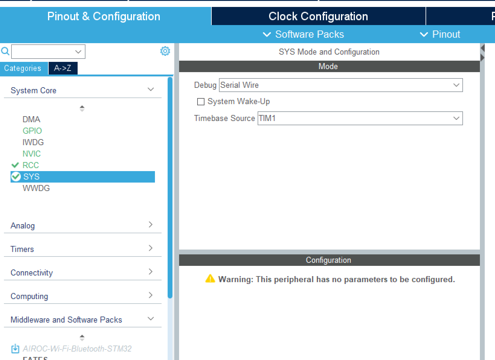
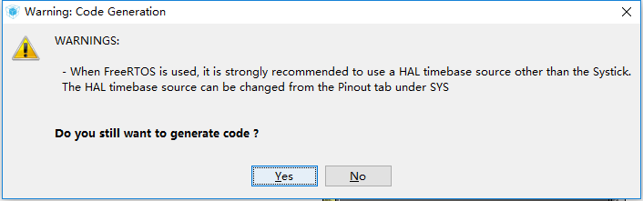
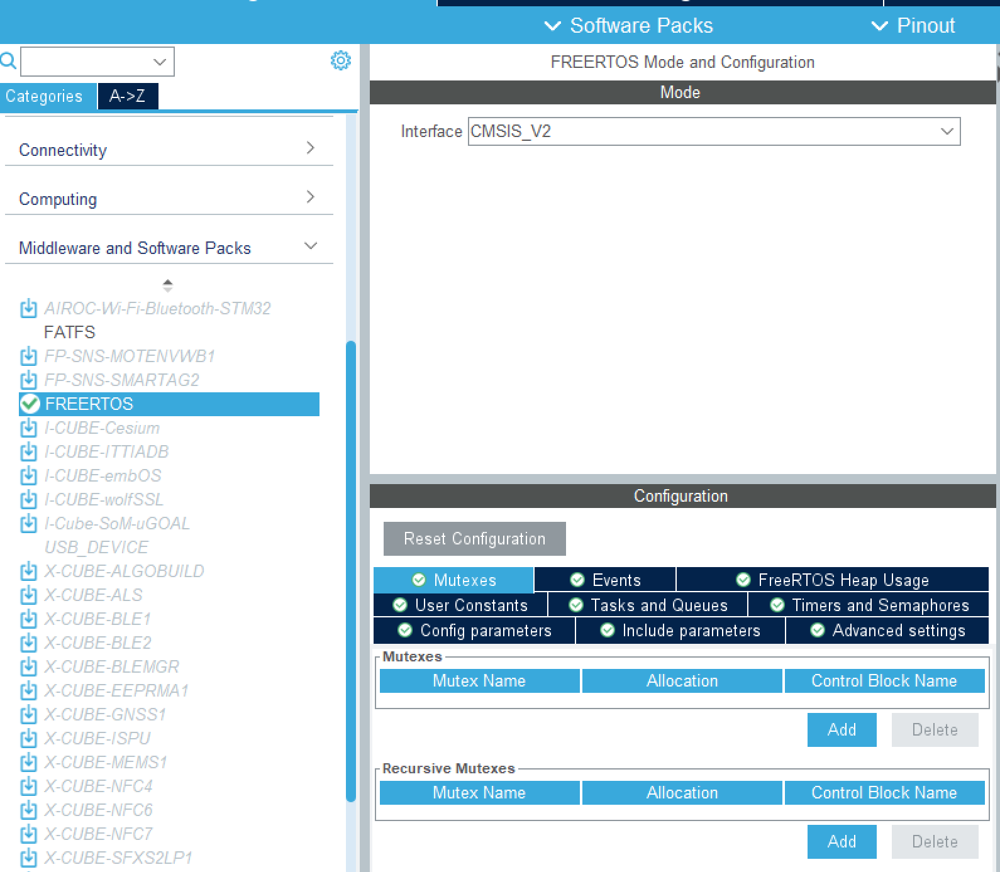

### 在cube中完成常规配置

---

### SYS时钟源

FreeRTOS会自动占用Sys tick，为防止冲突，要将Timbase Source换成其他定时器

> 在基于STM32 HAL的项目中，一般需要维护的 “时基” 主要有2个：
>
> 1. HAL的时基，SYS Timebase Source
> 2. OS的时基（仅在使用OS的情况下才考虑）
>
> **SYS Timebase Source** 是STM32的HAL库中的新增部分，主要用于实现 **HAL_Delay()** 以及作为各种 **timeout** 的时钟基准。
>
> 我们可以通过 **SysTick（系统滴答定时器）** 或 **（TIMx）定时器** 的方式来维护  **SYS Timebase Source** 。在裸机运行的情况下，我们一般选择默认的 **SysTick** 方式即可
>
> 在使用了OS（操作系统）之后，OS的运行也需要一个时钟基准（简称“时基”），来对任务和时间等进行管理。而OS的这个 **时基** 一般也都是通过 **SysTick（滴答定时器）** 来维护的，因此在使用过OS后，我们会选择用TIM来作为HAL的时基。
>
> 从原理上来说，Systick定时器和开发板上的通用定时器 **没有区别** 。 从功能上来说，Systick定时器主要是用来用来进行延时的（就是让CPU一直重复计数这件事），而通用或者高级定时器往往用来进行PWM输出、输入捕获等功能
>
> ps.如果选择HAL和OS共用Sys Tick，会出现
>
> 

---

### Middleware and Software Packs

选择Middleware and Software Packs一栏，选择FREERTOS

interface选择CMSIS_V2

> CMSIS-RTOS有两个版本，均已os开头，区别如下                 ——来源于[ARM](https://arm-software.github.io/CMSIS_5/latest/General/html/index.html)
>
> CMSIS-RTOS1，适用于Cortex-M0/M0+/M3/M4/M7
>
> CMSIS-RTOS2，在CMSIS-RTOS1的基础上做了扩展, 适用于All Cortex-M, Cortex-A5/A7/A9 。但是占用比较大
>
> 两个版本的部分API并不兼容，但均可使用原生API。

下面的Configuration中有许多选项卡,可根据目的进行配置：

**Mutexes**：互斥锁，是一种同步机制，用于控制多个任务对共享资源的访问，以确保只有一个任务可以访问该资源，从而避免竞争条件和数据损坏。

**Events**：事件，事件是一种实现任务之间通信的机制，主要用于实现多任务之间的同步。但事件通信只能是事件类型的通信无数据传输。可以实现一对多、多对多的同步。一个任务可以等待多个事件发生，可以是任何一个事件发生时唤醒任务进行事件处理，也可以是几个事件都发生后才唤醒任务进行事件处理。

**Tasks and Queues**：

Tasks：任务，在多任务系统中，根据功能的不同，把整个系统分割成一个个独立的且无法返回的函数，这个函数我们称为任务。系统中的每一任务都有多种运行状态。系统初始化完成后，创建的任务就可以在系统中竞争一定的资源，由内核进行调度。

Queues：队列，可以在任务与任务、任务与中断之间传递消息，队列中可以存储有限的、大小固定的数据项目。任务与任务、任务与中断之间要交流的数据保存在队列中，叫做队列项目。队列所能保存的最大数据项目数量叫做队列的长度，创建队列的时候会指定数据项目的大小和队列的长度。由于队列用来传递消息的，所以也称为消息队列。

**Timers and Semaphores**：

Timers：软件定时器不需要额外使用硬件定时器，而且可以创建很多个。使用软件定时器时，我们是在创建软件定时器时指定软件定时器的回调函数，在回调函数中实现相应的功能。

Semaphores：信号量是操作系统中重要的一部分，信号量一般用来进行资源管理和任务同步，FreeRTOS
中信号量又分为二值信号量、计数型信号量、互斥信号量和递归互斥信号量。
