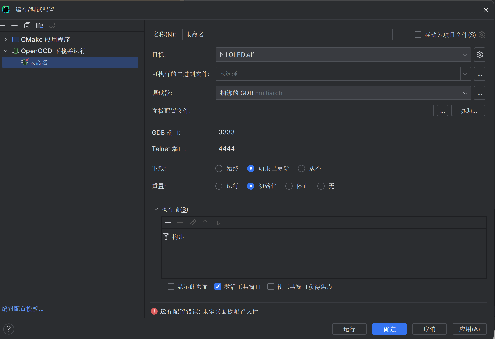
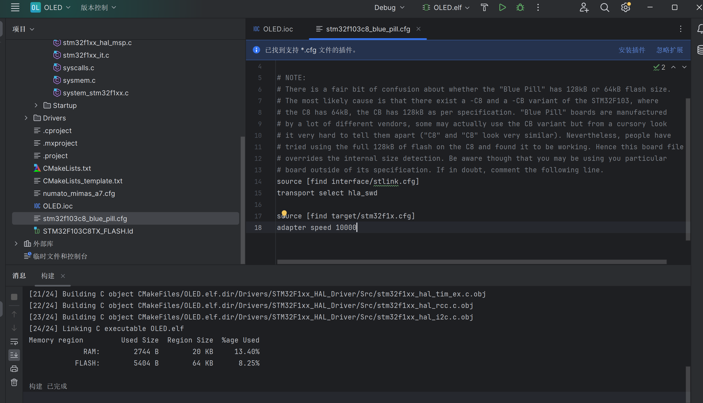

# Clion+cube配置过程

## 在clion中创建项目

（以oled项目创建过程为例

在clion项目文件夹目录下新建文件（记住此处的命名）


通过clion打开stm32cubemx，把芯片型号换好，正常配置cube，注意Project Manager中工程名字一定要和第一张图里的命名保持一致，点击GENERATE CODE，要出现"do you want to over write it "的提示字样才是正确复写


然后就可以看到这样的界面噜


*接下来配置调试和烧录工具(openOCD)

## openOCD

点击”编辑配置“


然后点击左上角处的+号，选择openOCD




配置好可执行的二进制文件，然后点击面板配置文件的”协助“，选择蓝色药丸（别的也可以，点击复制到项目并使用，然后就可以叉掉这个界面了


回到项目主页面，在文件管理处找到刚刚复制过来的蓝药丸.cfg文件，然后用以下代码替换掉该文件的内容

```
source [find interface/stlink.cfg]
transport select hla_swd

source [find target/stm32f1x.cfg]
adapter speed 10000
```

如图



保存修改即可.

## 调试

在elf左边有个Debug，点它，弹出的选项卡长这样就好（不用特别去改


保存修改后就可以开始锤(编译)和运行噜，插入st-link烧录(点三角形)后可以看到如下成功界面：(红字但是看字不看色)


至此IDE的配置搞定，可以快乐地写代码噜（喜
