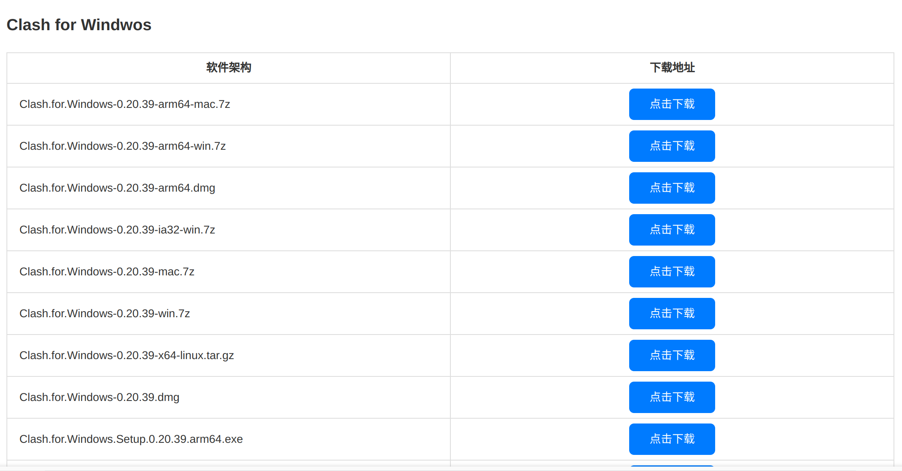
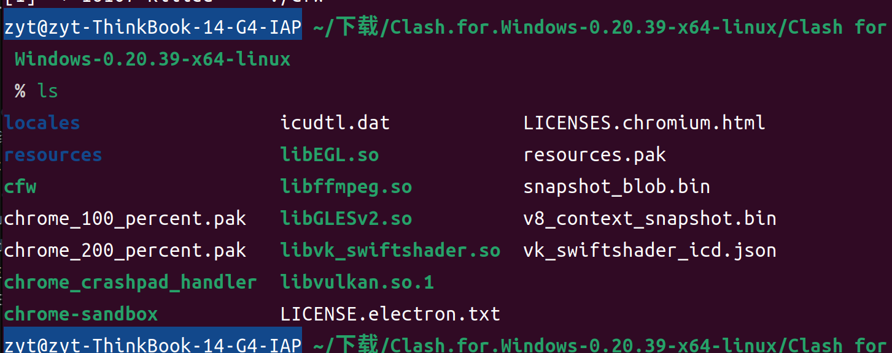
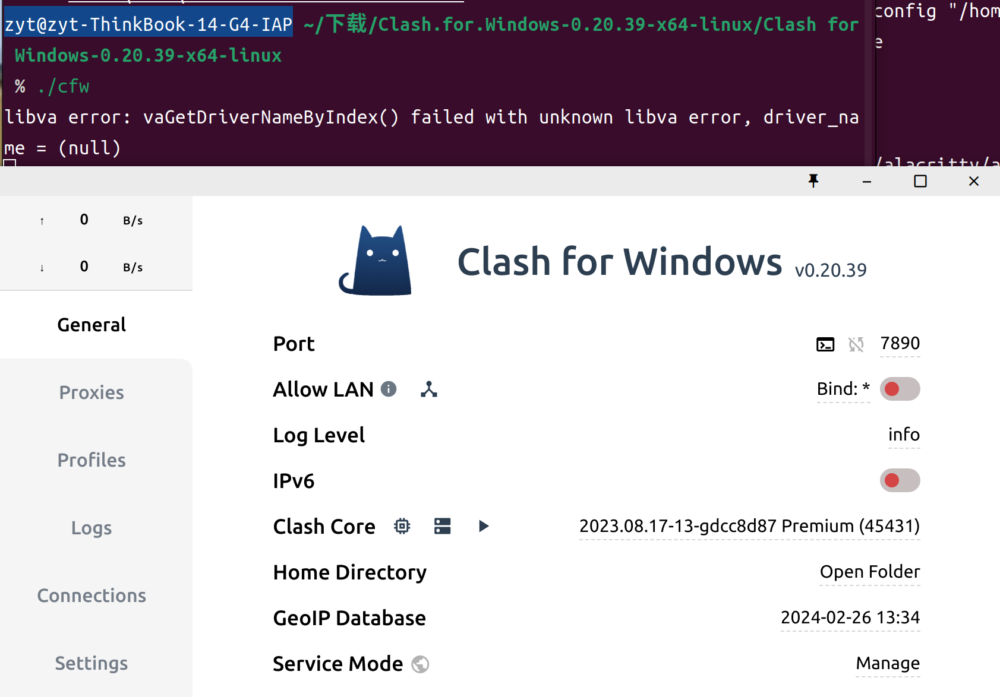
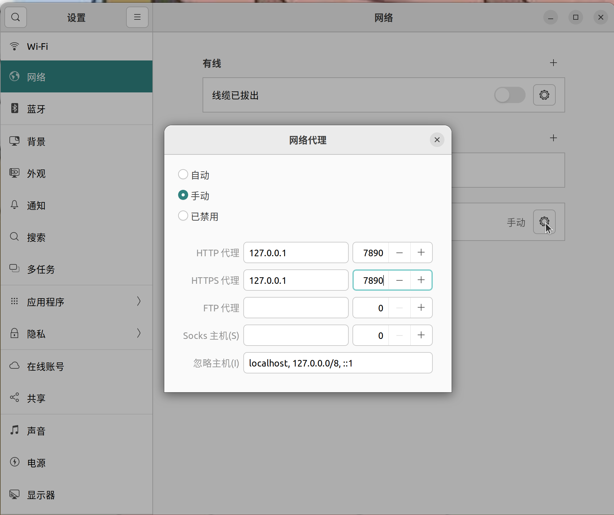

## 下载

clash官网：https://www.clash.la/releases/

选择倒数第三个linux版（是的它的名字叫Clash for Windows Linux版)

下载之后解压

进入解压后的文件（注意要进到里面那一层，该位置ls的结果如下)

然后在该工作目录下运行命令  `./cfw` 即可打开clash

## 配置

点开右上角的设置，配置代理

7890是本机的clash默认端口

然后配置好url，点击General中的start with linux就好啦
