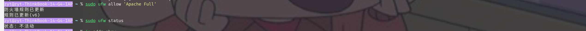

如何用在Ubuntu22.04上用web服务创建自己的小网站------>[点我](https://blog.csdn.net/a_small_cherry/article/details/122973092?ops_request_misc=%257B%2522request%255Fid%2522%253A%2522170996398516800184148786%2522%252C%2522scm%2522%253A%252220140713.130102334..%2522%257D&request_id=170996398516800184148786&biz_id=0&utm_medium=distribute.pc_search_result.none-task-blog-2~all~top_positive~default-1-122973092-null-null.142^v99^control&utm_term=ubuntu%E5%AE%89%E8%A3%85apache&spm=1018.2226.3001.4187)

### 下载Apache

```
sudo apt update
```

```
sudo apt install apache2
```

下载完成后可以通过下面命令查看apache2的运行状态：

```
sudo systemctl status apache2
```

输出示例如下


### 在防火墙打开http和https端口

```
sudo ufw allow 'Apache Full'
```

查看改变后的状态：

```
sudo ufw status
```



### 验证Apache成功安装

在浏览器中输入 `http://YOUR_IP_OR_DOMAIN/` 

可以使用命令 `ip addr show` 查看自己的ip：


比如搜索本机就是 `http://127.0.0.1` 然后就可以看到apache的ubuntu欢迎界面啦


