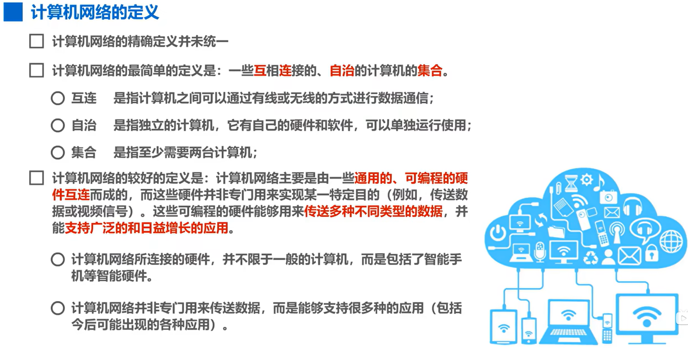
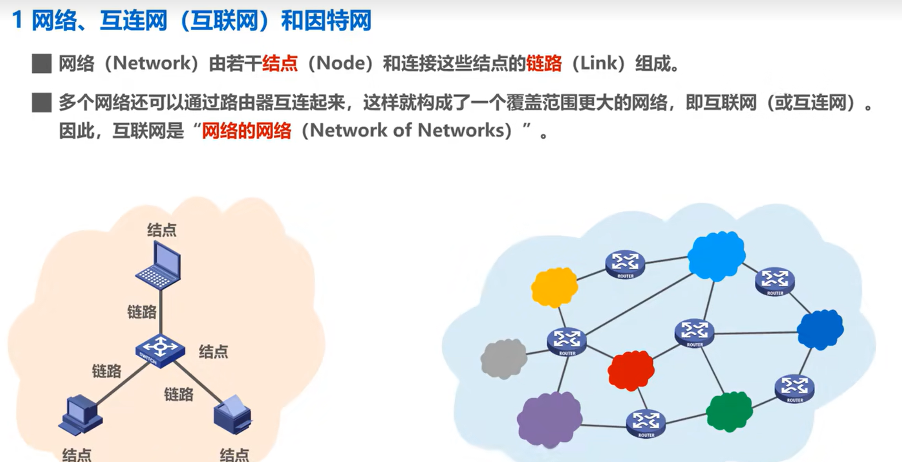
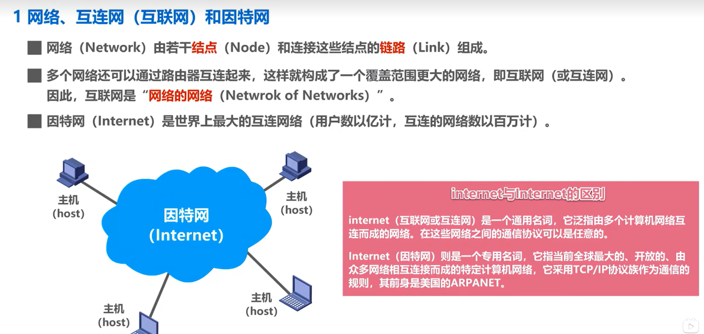
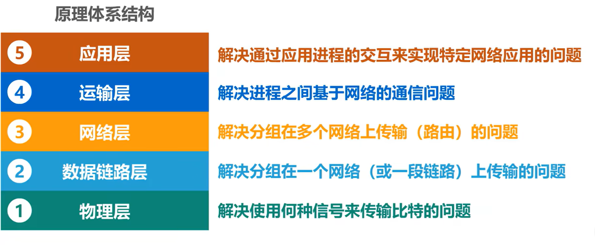
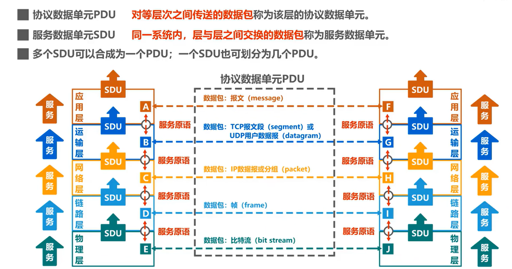

来自 [bilibili](https://www.bilibili.com/video/BV1c4411d7jb?p=2&vd_source=1a6677185aa0e41216fcb384caf3a7ee)  的听课笔记

## 概述

#### 计算机网络

#### 计算机网络的分类

（按传输介质分类）

| 有线网络           | 包括双绞线网络，光纤网络等 |
| ------------------ | -------------------------- |
| **无线网络** | **wifi**             |

（按覆盖范围分类）

* 广域网WAN：可以覆盖一个国家甚至横跨几个洲，也称为远程网，是因特网的核心部分，其任务是为核心路由器提供远距离高速连接，互联分布在不同区域的MAN和AN
* 城域网MAN：覆盖范围一般为一个城市，作为城市主干网互联大量企业，机构和校园局域网
* 局域网LAN：一般用微型计算机或工作站同通过高速通信链路相连，覆盖范围小，通常由某个单位单独拥有，一个学校或企业大多拥有许多个互连的局域网，称为校园网或企业网
* 个域网PAN：在个人工作的地方把属于个人使用的电子设备，比如无线耳机，键盘，鼠标，打印机等用无线技术链接起来的网络

#### 计算机网络的性能指标

* 速率：连接在计算机网络上的主机在数字信道上传送比特的速率，也称为比特率或数据率，常用单位有bps(bit/s)，kbps，Mbps等等
* 带宽：带宽一词最初指的是电磁波频带的宽度，也就是信号的最高频率与最低频率的差值。它被更广泛地借用在数字通信中，用来描述网络或线路理论上传输数据的最高速率。带宽的这两种表述之间有着密切的联系，它们之间成正相关的关系
* 吞吐量：在某个单位时间内通过某个网络的总数据量
* 时延

#### **互联网&因特网**

> **web和internet的区别**
>
> =**[Web](https://m.baidu.com/s?word=Web&sa=re_dqa_zy) 和 [Internet](https://m.baidu.com/s?word=Internet&sa=re_dqa_zy) 的区别主要体现在概念和应用上。**=以下是详细介绍：
>
> * 概念。Internet是一个全球性的计算机互联网络，采用TCP/IP协议，由许多小的网络（子网）互联而成，每个子网中连接着若干台计算机（主机），旨在实现信息资源的相互交流；而Web，也称为万维网，是基于超文本和HTTP协议的全球性的、动态交互的、跨平台的分布式图形信息系统，建立在Internet之上，为浏览者在Internet上查找和浏览信息提供了图形化的、易于访问的直观界面。
> * 应用。Internet更加注重协议和硬件基础设施，表现为网络中互联的计算机主机和网络设备（如路由器、转换器、网线等）的集合；而Web则更加注重内容部分，表示为网络上的内容，实际形式包括超文本、音频、图像等，基于Web服务器向用户传递一些Web内容，基于HTTP进行传输。^2^
>
> 总的来说，Internet为Web提供了必要的网络环境和基础设施，而Web建立在Internet之上，为全球用户提供了丰富的信息和服务。

## TCP/IP协议

TCP/IP协议主要分为四层，即网络接口层（主机-网络层），网际层，运输层，应用层。在教学过程中也会分为五层，即把原来的网络接口层分为物理层和数据链路层两层

