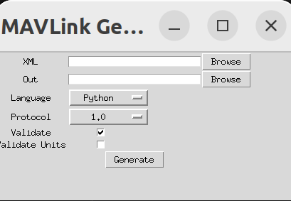

## Quick start

### Generate C headers

To install the minimal MAVLink environment on Ubuntu LTS 20.04 or 22.04, enter the following on a terminal:（Windows也一样)

```bash
# Dependencies
sudo apt install python3-pip

# Clone mavlink into the directory of your choice
git clone https://github.com/mavlink/mavlink.git --recursive
cd mavlink

python3 -m pip install -r pymavlink/requirements.txt
```

然后输入 `python mavgenerate.py` 

就可以见到这个小小的图形化窗口。



把language换成C，XML传入自己写好的文件，Out填入要用来放置头文件的文件夹（一般与XML放在一起)，然后generate即可
