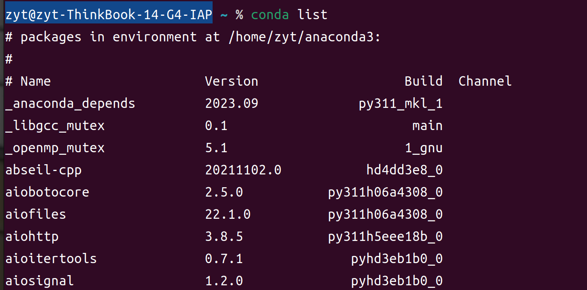
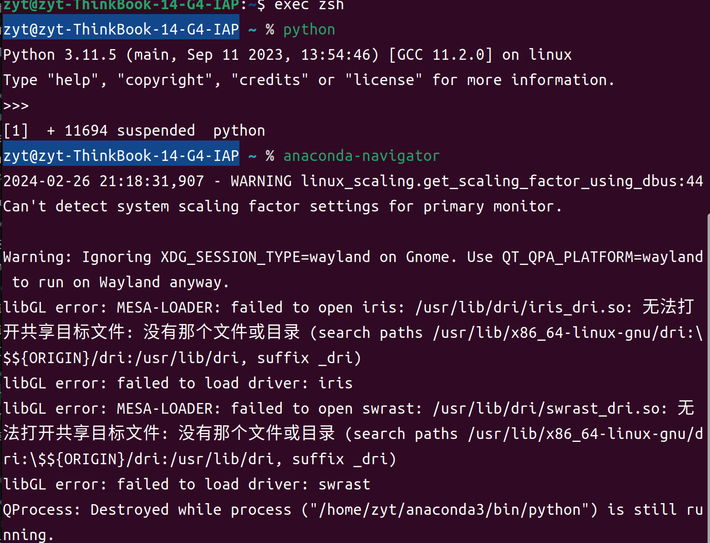

opencv听课笔记，详情见[SSC202学长的github](https://github.com/SSC202/OpenCV/tree/main/OpenCV-Python/Note)

## 安装

#### Anaconda环境

官网https://www.anaconda.com/ 下载anaconda的linux版，然后在命令行输入：

```
bash ~/Downloads/Anaconda3-5.0.1-MacOSX-x86_64.sh
```

(Downloads是自己放下载文件的位置）

注意首词bash也需要输入，无论是否用的Bash shell。

看到 “Thank you for installing Anaconda3!" 的时候即下载完成

关闭终端，然后再打开终端以使安装后的Anaconda启动。

验证安装结果。可选用以下任意一种方法：

① 在终端中输入命令 ***conda list*** ，如果Anaconda被成功安装，则会显示已经安装的包名和版本号。(要重启终端才能看到！)



② 在终端中输入 ***python*** 。这条命令将会启动Python交互界面，如果Anaconda被成功安装并且可以运行，则将会在Python版本号的右边显示“Anaconda custom (64-bit)”。退出Python交互界面则输入 ***exit()*** 或 ***quit()*** 即可。

③ 在终端中输入 ***anaconda-navigator*** 。如果Anaconda被成功安装，则Anaconda Navigator的图形界面将会被启动。



(但，，，汗)

#### Opencv

```
pip install opencv-contrib-python
```

(装不了可以翻墙了再装）

## API

opencv官网  https://opencv.org/

#### img-图像

读入图像: args=路径，读取方式

```
cv2.imread('path',mode)

img=cv2.imread('path',mode)   #创建图像对象
```

显示图像：args=图像名，imread返回值

```
cv2.imshow('name',img)
```

加载窗口（即先创建一个空窗口，可以指定大小，后面的imshow再将图像加载到此窗口上)：

args=名字，图片大小

```
cv2.namedWindow('img', cv2.WINDOW_AUTOSIZE)
```

保存图像：args=图片保存的文件名，保存对象     （一般不需要用到)

```
cv2.imwrite('name',img)
```

颜色空间转换函数，args=图片，转换的格式(如RGB，灰度图像等等)

```
cv2.cvtColor('picture',mode)
```

> cv2.COLOR_BGR2RGB 将BGR格式转换成RGB格式
>
> cv2.COLOR_BGR2GRAY 将BGR格式转换成灰度图片

#### vedio-视频

创建对象  参数为摄像头设备的索引号，电脑内置摄像头默认为第一个，即为0，其他依次顺延

```
cap = cv2.VideoCapture(1)
```

读取视频  视频是一帧一帧地传的，所以需要放在一个死循环中读取，每一次read返回一个元组，第一个数据为布尔值，判断是否读到视频内容，第二个为该帧的内容

```
ret,frame = cap.read()
```

读取/设置函数信息

```
cap.get(ID)
cap.set(ID,val)
```

释放对象

```
cap.release()
```

## 绘图

本人电脑屏幕上的坐标大约是(0,0)--->(470,260)

画线: args=图像，左上角点，右上角点,BGR元组，线条粗细

```
cv2.line()
```

画圆：args=图像，圆心，半径，BGR元组，线条粗细（为-1时填充整个圆形)

```
cv2.circle()
```

画矩形：args=图像，左上角点，右上角点，BGR元组，线条粗细（为-1时填充整个矩形)

```
cv2.rectangle()
```

写文字：args=图片，显示的文字，检测框左上角坐标，字体，字体大小，颜色，字体粗细

```
cv2.putText()
```

此外还有一些参数（类似宏定义的)比如 `cv2.LINE_AA`可以放在封闭曲线和cv2.line函数的最后一个参数（在前面已有参数之后再加上)表示让线条更平滑，也可以在cv2.putText()函数中用来表示字体粗细；`cv2.FONT_HERSHEY_SIMPLEX` 作为cv2.putText()的‘字体’的参数

## 鼠标事件

可以通过以下代码查看鼠标事件的种类

```
import cv2
events = [i for i in dir(cv2) if 'EVENT' in i]
print(events)
```

返回：

```
['EVENT_FLAG_ALTKEY', 'EVENT_FLAG_CTRLKEY', 'EVENT_FLAG_LBUTTON', 'EVENT_FLAG_MBUTTON', 'EVENT_FLAG_RBUTTON', 'EVENT_FLAG_SHIFTKEY', 'EVENT_LBUTTONDBLCLK', 'EVENT_LBUTTONDOWN', 'EVENT_LBUTTONUP', 'EVENT_MBUTTONDBLCLK', 'EVENT_MBUTTONDOWN', 'EVENT_MBUTTONUP', 'EVENT_MOUSEHWHEEL', 'EVENT_MOUSEMOVE', 'EVENT_MOUSEWHEEL', 'EVENT_RBUTTONDBLCLK', 'EVENT_RBUTTONDOWN', 'EVENT_RBUTTONUP']
```

通过在事件发生后调用对应的回调函数，可以实现相应的操作

创建窗口并建立中断函数与之绑定：（两句的顺序不能颠倒，一定要先有窗口再绑上回调函数)

```
cv2.namedWindow('img')                      #创建窗口
cv2.setMouseCallback('img',function_name)   #创建回调函数
```


## 滑动条

滑动条创建函数：args=滑动条名字，滑动条被放置的窗口的名字，滑动条最小值，滑动条最大值，回调函数

(也要先创建窗口，再将滑动条以及回调函数与之绑定)

```
cv2.createTrackbar()
```

滑动条键值获取函数：args=滑动条名字，滑动条被放置窗口的名字

```
cv2.getTrackbarPos()
```
