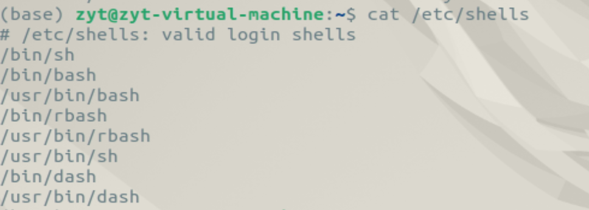
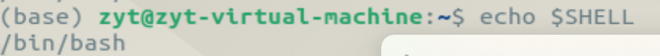
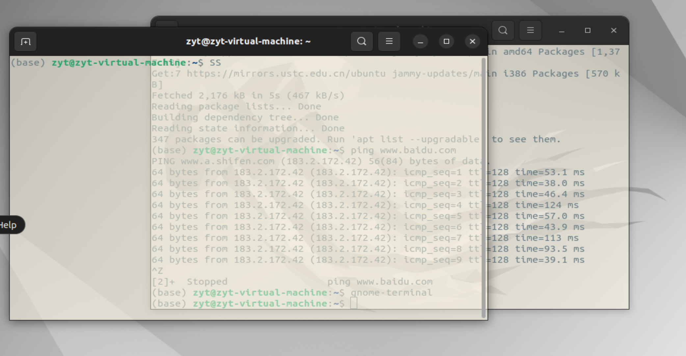

## 终端是什么

### 终端与Shell？Bash？

我们在 Linux 上常说的终端其实是 **终端模拟器 - Terminal Emulator**（一种  **模拟终端的程序**  ），也称为 —— **虚拟终端** ，但平时一般直接称为终端，这种叫法有其历史来源，详见 [终端沿革与Shell](https://blog.csdn.net/Amentos/article/details/129290846)

在linux上的黑窗口就是终端 ，终端里面 内嵌了一个shell，这个shell 我们将其称为**命令解释器** 。 当我们在终端输入一些字符串的时候，shell就会解析这些字符串，然后给我们反馈结果。

>
> 终端 只是人机交互的一个接口，提供输入输出命令的交互界面。终端的主要任务是接收用户输入的命令，并提交给 Shell。
>
>     Shell 是命令解析器，主要任务是翻译命令。Shell 将终端输入的命令转化成内核能够理解的语言并传递给内核，由内核执行命令，并将执行结果返回给终端。(Shell是一层壳，内核Kernal的壳)
>
>     当我们打开终端时，Shell 也会自动启动，操作系统会将终端和 Shell 关联起来。接着我们在终端输入命令，Shell 就负责解释命令
>

shell有很多种，比如**bash**, z shell, powershell(微软)

可以使用命令 `cat /etc/shells`查看系统中所有的终端



使用命令 `echo $SHELL`查看当前所用终端



### 更换ubuntu默认终端

ubuntu22.04LTS默认终端模拟器是gnome-terminal，就是这个丑丑的东西：



在命令行中运行

```
$ gnome-terminal
```

就可以打开一个新的终端，，这个命令还有一些其他参数，，不过不重要()

**除了gnome，还有很多其他的终端模拟器，比如 Terminator，Guake , alacritty等等**

##### 下载alacritty

官网[Alacritty - A cross-platform, OpenGL terminal emulator](https://alacritty.org/)，，虚拟机不知道为什么登不上去，，，

（wait
