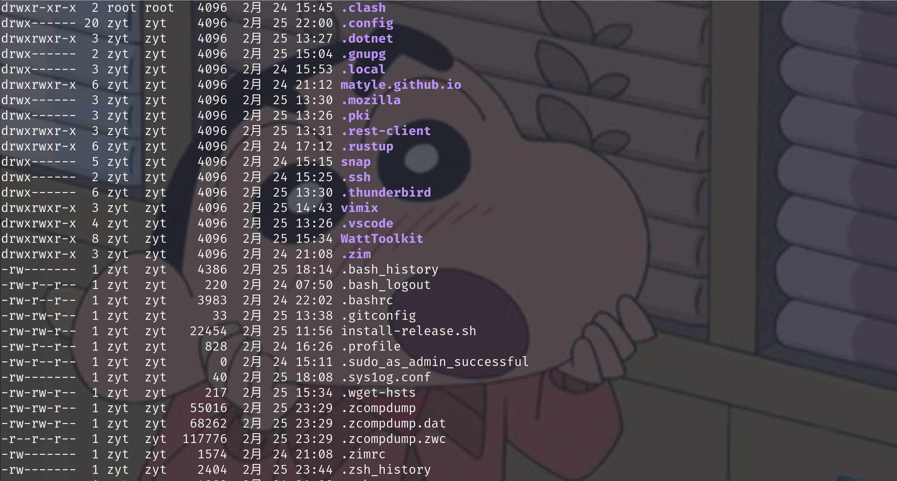

电控培训听课笔记，指路lyn学长的github

## 查看目录的工具

```
sudo apt install ranger
```

下载ranger，然后在工作目录下输入 `ranger` 就可以得到很美观的：


ranger和tree都是可以比较清晰地看到目录结构的工具

## 根目录下的文件夹们

* bin：所有用户可用的基本命令程序文件，比如zsh，bash，以及ls等命令
  可以通过 `which []` 来查找某程序的位置：

  
* boot：引导加载其必须用到的各静态文件，如kernel，ramfs，grub（bootloader)

  boot是一个启动引导分区，比如引导系统由黑黑的终端产生图形化界面等等；grub是一个（类似于windows的BIOS？)引导器，指引你进入哪个系统。（是的主题也是在这里换的)
* dev：设备和特殊文件；Linux中所有插入电脑的设备都会被识别为文件，如磁盘（nvme)，U盘，串口（ttyUSB)，还有一堆tty（终端)


* etc：系统程序的静态配置文件（配置文件，比如grub的那个配置文本)
  然后要注意一下/etc/profile.d是保存环境变量的地方

  
* home：唯一一个自己本来有权限的目录
* lib：为系统启动或根文件系统上的应用程序（/bin，/sbin等) 提供共享库，以及为内核提供内核模块。（相当于把应用程序本体精简化，把一部分程序做成共享库的形式，使软件下载更方便)
  （还包括c语言的很多头文件，基本数据形式的定义，，以及gcc等等)


* lib64：特定字长系统上的库文件，64位系统则为/lib64
* media：挂载点目录，通常用来挂载移动设备

  


这里是自己的盘（不包括C盘)，这些盘是可以通过右边那个三角形弹出的

* mnt：挂载点目录，通常挂载额外的临时文件系统
* opt：附加应用程序的安装位置，可选；比如ros等


* usr：全局共享的只读数据路径（不是user！)
  平时 `sudo apt install` 的文件一般都放在/usr/bin里
  /usr/include则是c语言头文件

  
* root：管理员的家目录
* run：存放动态的，不持久的应用程序运行数据
* srv：系统上运行的服务用到的数据
* tmp：临时文件
* var：频繁发生变化的文件,如日志，状态之类的（可以删)

## 文件属性和权限

输入ls -al命令可以看到



这些信息反映了-------->

###### 属性

（最左边那一排字母)第一个字母是文件属性，d表示目录；b表示块设备文件，比如硬盘；c表示字符设备文件；l是符号链接文件，又称软链接文件；p是pipe，命名管道文件；s是套接字文件，用于实现两个进程的通信（不用记)

###### 权限

属性字母后面跟着三组rwx，分别是文件所有者（u)，所在群组（g)，其他人（o)的权限；对文件来说r代表读，w代表写，x代表执行；对目录来说r代表读取其中文件名，w代表更改文件名，x代表进入该目录

后边的两列名字（图中的zyt和zyt)分别表示文件所有者和所在群组

###### 命令

可以使用 `chmod` 命令来更改权限：

```
chmod [xxx] [dir/file]
```

xxx代表三个数字，分别是7/6/5/4/3/2/1，代表了权限等级（r=4,w=2,x=1)

可以用 `chgrp` 更改所在的群组

```
chgrp [groop] [dir/file]   //必要时加sudo提权
```

可以用 `chown` 更改所有者

```
chown [owner] [dir/file]
```


使用 `file` 命令可以查看文件的一些属性：`file [name_of_file]`

因为linux不依赖文件拓展名去识别文件，所以有的时候需要专门的查询命令来判断这是一个什么东西

--->bash script


## 文本编辑器

gedit，vim，nano等

gedit其实还挺好用的（)

vim：---->出门下拐


## 终端与SHELL

使用 `neofetch` 可以查看（可以在bash中下载)


可以看到shell和terminal的一些信息（但是为什么我的terminal是ranger？)

可以用 `echo $SHELL` 查看所用的壳

> '$'符号表示取变量
>
> $SHELL就是一个变量
>
> echo是回显的意思，可以将变量中的值显现出来

---


## 补充

重新编辑了一下.yml文件，，把shell那一句顶格了，重新转成.toml后得到了：


但是alacritty里面鼠标还是无法显示捏

---


鼠标后续：

在.yml文件481行左右把 `hide_when_typing` 改成false就搞腚啦！


