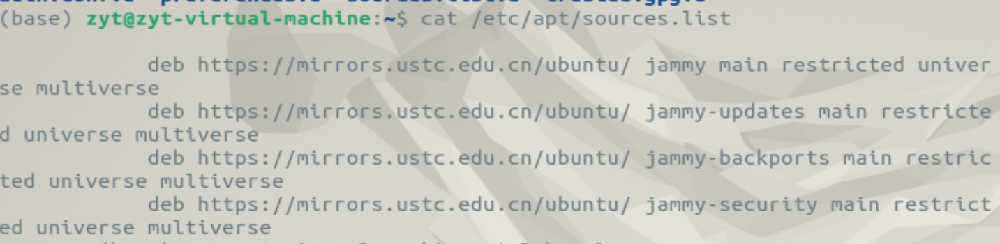
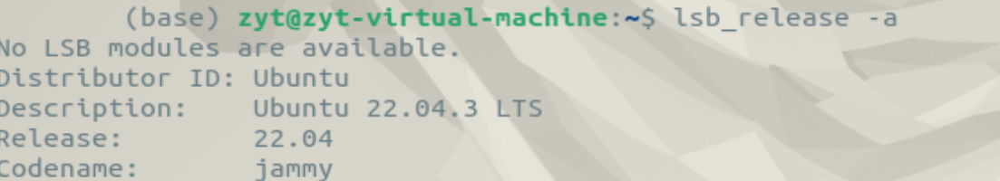
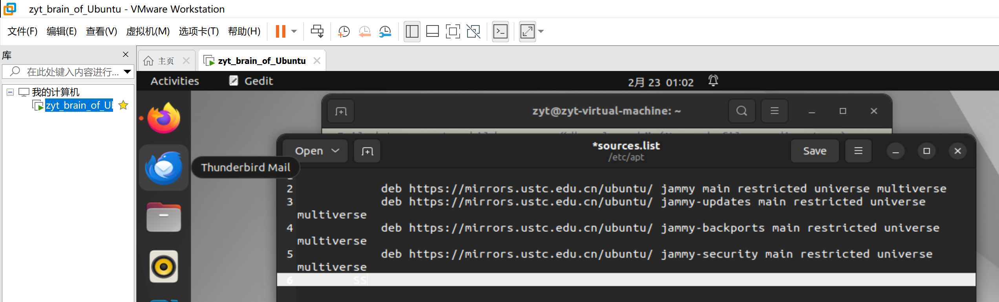
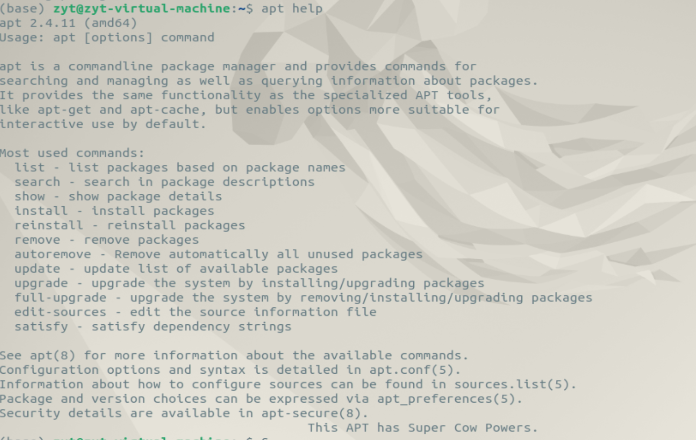
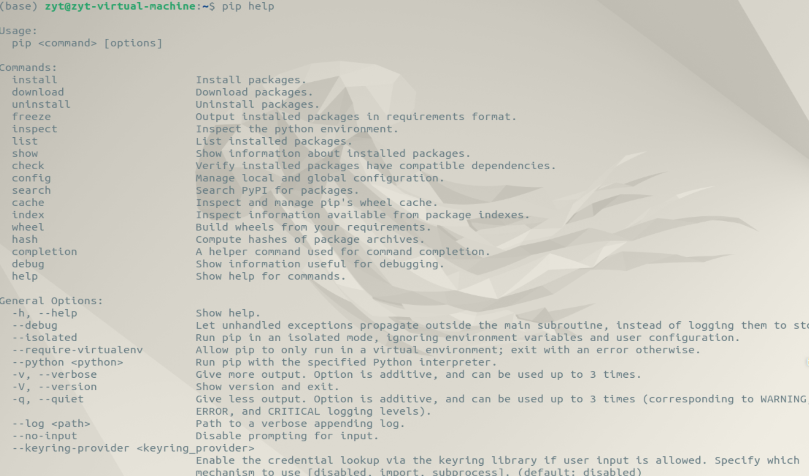

## 为什么要换源

Ubuntu能从官方指定的服务器上下载各种软件，此处所说的源可以理解为下载的服务器的地址，默认的源一般在国外，下载速度就会比较感人，因此一般会把源换成国内的镜像网址，常见的有国内一些高校和企业的源

## 怎么换源

查看自己目前的源：`cat /etc/apt/sources.list`



源的网址都存放在这个文件里，换源就是要更改文件内容   （如图是已经换好的中科大源，Ubuntu默认源是 `http://cn.archive.ubuntu.com/ubuntu/`服务器的）

在寻找新的源之前还要看一眼自己的ubuntu版本：`lsb_release -a`



（jammy是22.04的吉祥物）

### 找源

以下的源都是jammy版的

清华源：https://mirrors.tuna.tsinghua.edu.cn/

    [ubuntu | 镜像站使用帮助 | 清华大学开源软件镜像站 | Tsinghua Open Source Mirror](https://mirrors.tuna.tsinghua.edu.cn/help/ubuntu/)

```
# 默认注释了源码镜像以提高 apt update 速度，如有需要可自行取消注释
deb https://mirrors.tuna.tsinghua.edu.cn/ubuntu/ jammy main restricted universe multiverse
# deb-src https://mirrors.tuna.tsinghua.edu.cn/ubuntu/ jammy main restricted universe multiverse
deb https://mirrors.tuna.tsinghua.edu.cn/ubuntu/ jammy-updates main restricted universe multiverse
# deb-src https://mirrors.tuna.tsinghua.edu.cn/ubuntu/ jammy-updates main restricted universe multiverse
deb https://mirrors.tuna.tsinghua.edu.cn/ubuntu/ jammy-backports main restricted universe multiverse
# deb-src https://mirrors.tuna.tsinghua.edu.cn/ubuntu/ jammy-backports main restricted universe multiverse

deb http://security.ubuntu.com/ubuntu/ jammy-security main restricted universe multiverse
# deb-src http://security.ubuntu.com/ubuntu/ jammy-security main restricted universe multiverse

# 预发布软件源，不建议启用
# deb https://mirrors.tuna.tsinghua.edu.cn/ubuntu/ jammy-proposed main restricted universe multiverse
# # deb-src https://mirrors.tuna.tsinghua.edu.cn/ubuntu/ jammy-proposed main restricted universe multiverse
```

中科大源：[Ubuntu 源使用帮助 — USTC Mirror Help 文档](https://mirrors.ustc.edu.cn/help/ubuntu.html)

```
# 默认注释了源码仓库，如有需要可自行取消注释
deb https://mirrors.ustc.edu.cn/ubuntu/ jammy main restricted universe multiverse
# deb-src https://mirrors.ustc.edu.cn/ubuntu/ jammy main restricted universe multiverse

deb https://mirrors.ustc.edu.cn/ubuntu/ jammy-security main restricted universe multiverse
# deb-src https://mirrors.ustc.edu.cn/ubuntu/ jammy-security main restricted universe multiverse

deb https://mirrors.ustc.edu.cn/ubuntu/ jammy-updates main restricted universe multiverse
# deb-src https://mirrors.ustc.edu.cn/ubuntu/ jammy-updates main restricted universe multiverse

deb https://mirrors.ustc.edu.cn/ubuntu/ jammy-backports main restricted universe multiverse
# deb-src https://mirrors.ustc.edu.cn/ubuntu/ jammy-backports main restricted universe multiverse

# 预发布软件源，不建议启用
# deb https://mirrors.ustc.edu.cn/ubuntu/ jammy-proposed main restricted universe multiverse
# deb-src https://mirrors.ustc.edu.cn/ubuntu/ jammy-proposed main restricted universe multiverse
```

（还有aliyun和163之类的，不过上面俩应该够了）

### 改源

编辑list文件

```
sudo gedit /etc/apt/sources.list
```

然后就会弹出



然后就可以编辑噜，编辑完保存

然后更新软件列表 `sudo apt-get update`

进行软件更新 `sudo apt-get upgrade`

然后就o啦

还有一个办法就是fish的一行代码解决人生烦恼：

```
wget http://fishros.com/install -O fishros && . fishros
```

## 其他

（经常在下载指令看到这俩，遂查之

#### apt

Advanced Package Tool，一个开源命令行工具，用于管理软件包，例如安装，更新，升级和删除。



>
>
> ### apt 语法
>
> ```
>   apt [options][command][package...]
> ```
>
> * **options：** 可选，选项包括 -h（帮助），-y（当安装过程提示选择全部为"yes"），-q（不显示安装的过程）等等。
> * **command：** 要进行的操作。
> * **package** ：安装的包名。

详细命令示例见[apt](https://www.runoob.com/linux/linux-comm-apt.html)

#### pip

pip是**python的标准库管理器**，管理python的众多软件包。pip是python安装包里自带的，可以通过 `pip --version`查看当前版本

可以通过 `pip help`查看pip



（太多了没截完

`pip install <package>`是常用的下载命令，用于下载python库中存在的包（比如opencv就是这样下的）
