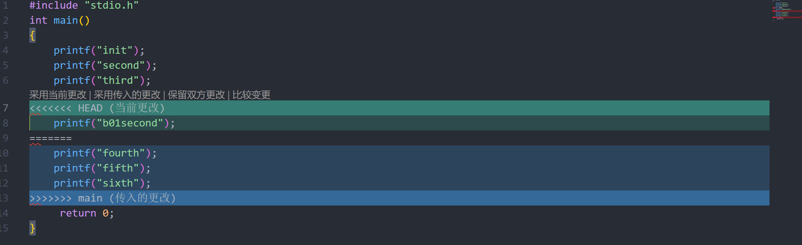

***本文档用于记录git和github使用中的各种实际需求和对应操作***

### 新建git本地仓库

```
git init
```

### 绑定远程仓库以及推送

```
$git remote add origin [remote address]  #常用于将本地仓库与远程仓库进行链接，以便可以同步远程仓库的内容。
$git branch -M main  
#git branch -M main 命令会将本地分支 main 重命名为 main,相当于在本地分支 main 上执行了一个 git branch 命令，这个命令会将当前分支名称设置为 main,并将本地分支 main 与远程分支 main 保持一致。#
$git push -u origin main
#用于将本地分支 main 的更新推送到远程分支 origin/main。在这个命令中，-u 参数指定了推送的分支，origin/main 是远程分支的名称。#
```

### 回退

```
git checkout <git_log_ID>
```

即可回退到过去的某个节点(如果回退两个节点及以上会出现head detached)，如果想回到过去某个版本并在此基础上来继续编写，一定要记得在checkout回来之后立刻新建分支：

```
git checkout -b <branch_name>
```

否则新做的修改不会保存

一旦回退几个版本之间的关系就变成了分支与分支之间的关系，如果回退到过去的某个节点后又想重新回到原先的进度，使用命令

```
git checkout main
```


### 融合分支

在某一分支上 `git merge <another_branch_name>`即将另一分支所作的更改融合到本分支上

可能会出现 `conflict`导致 `unmerged`



此时可以自行选择要采用哪一方的更改，或者共同比较更改之后再写入

注意这里的merge只是会将所选择的改动写入当前分支并成为新的 `uncommitted changes`，并不会影响那个 <`another_branch_name`>，后续也仍然可以通过 `checkout`来到那个分支
