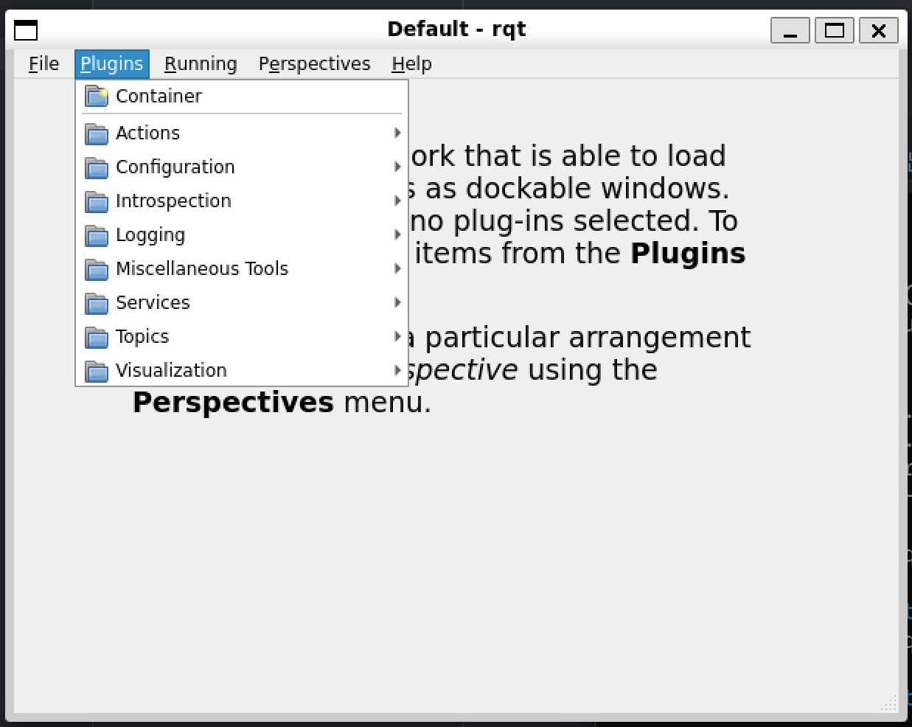

# Rqt是什么

Rqt是一个GUI框架，通过插件的方式实现了各种各样的界面工具

# 体验rqt

如果还没有安装：

```
$ sudo apt install ros-humble-rqt
```

然后通过一句很简单的指令就可以调出rqt界面

```
rqt
```

大概长这样：



当前还没有选择任何插件，可以在Plugins处选择，常用的有:

introspection中的Node Graph :观察节点关系和消息走向

Process Monitor:进程监测

Topics中的Message Publisher:用图形化界面模拟发布消息，不需要cli手搓

Service中的Serbice caller：可以模拟调用服务等

Visualization中的Plot，可以用来统计类图表，调pid等的时候可以试一试
