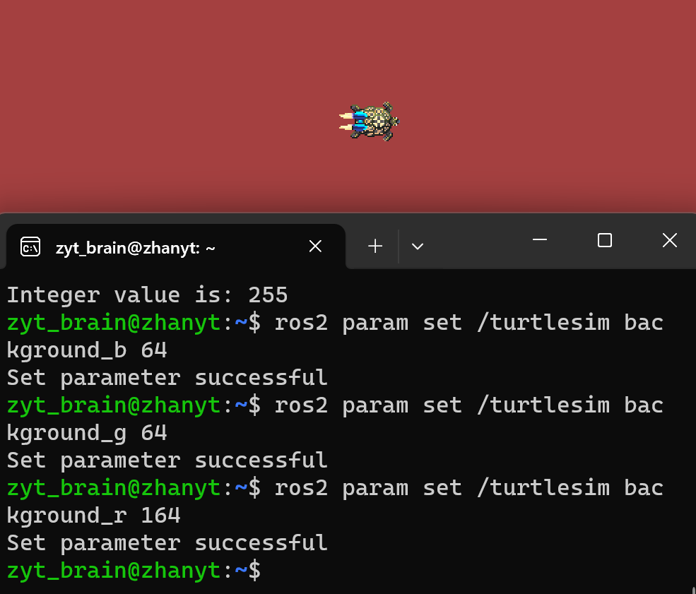

# 关于参数

参数是节点的一个配置值，可以认为参数是一个节点的设置。相比起用变量去确定某个值，使用这种动态的配置可以便捷地随时改变某个参数的值

Ros2参数是由键值对组成的，即名字搭配数据值。名字是字符串类型的数据，而值的数据类型是多种多样的，ros2支持的参数值有bool和bool[]，int64和int64[]，float64和float64[]，string和string[]，byte[](字节数组，可以用于表示图片，点云数据等信息)


# 关于参数的一些CLI工具

可以打开小乌龟模拟器尝试实操（）

```
ros2 run turtlesim turtlesim_node
ros2 run turtlesim turtle_teleop_key
```

## 查看节点有哪些参数

```
ros2 param list
```

可以看到：

```
zyt_brain@zhanyt:~$ ros2 param list
/teleop_turtle:
  qos_overrides./parameter_events.publisher.depth
  qos_overrides./parameter_events.publisher.durability
  qos_overrides./parameter_events.publisher.history
  qos_overrides./parameter_events.publisher.reliability
  scale_angular
  scale_linear
  use_sim_time
/turtlesim:
  background_b
  background_g
  background_r
  qos_overrides./parameter_events.publisher.depth
  qos_overrides./parameter_events.publisher.durability
  qos_overrides./parameter_events.publisher.history
  qos_overrides./parameter_events.publisher.reliability
  use_sim_time
```

> 其中最后一个 `use_sim_time`是每个节点都带的

## 详细查看某一个参数的信息

```
ros2 param describe /<node_name> <param_name>
```

其中 `<node_name>`之前记得带斜杠/

如：`ros2 param describe /turtlesim background_b`

```
zyt_brain@zhanyt:~$ ros2 param describe /turtlesim background_b
Parameter name: background_b
  Type: integer
  Description: Blue channel of the background color
  Constraints:
    Min value: 0
    Max value: 255
    Step: 1
```


## 查看参数值

```
ros2 param get /<node_name> <param_name>
```

如：

```
zyt_brain@zhanyt:~$ ros2 param get /turtlesim background_b
Integer value is: 255
```


## 设置参数值

```
ros2 param set /<node_name> <param_name> <value>
```



可以借助鱼的rgb工具来确认目标颜色的rgb分别是多少然后进行设置（而不是这样乱设）

[https://fishros.com/tools/pickr](https://fishros.com/tools/pickr/)


## 保存所设置的参数值

首先是给当前参数值拍快照

```
ros2 param dump /<node_name>
```

然后会同时返回保存的参数信息

```
zyt_brain@zhanyt:~$ ros2 param dump turtlesim
/turtlesim:
  ros__parameters:
    background_b: 64
    background_g: 64
    background_r: 164
    qos_overrides:
      /parameter_events:
        publisher:
          depth: 1000
          durability: volatile
          history: keep_last
          reliability: reliable
    use_sim_time: false
```


？为什么找不到.yaml文件？


# Python参数代码实现

* 使用 `declare_parameter("<param_name>",<param_val>)`来声明创建参数

```
self.declare_parameter("writer_timer_period",5)
```

* 在代码中将参数更新赋值给变量，使用 `get_parameter()`，如：

```
timer_period=self.get_parameter("writer_timer_period").get_parameter_value().integer_value
```

完整代码：

```
import rclpy
from rclpy.node import Node
from std_msgs.msg import String,UInt32             #导入消息类型,此处还添加了新的消息类型UInt32

from village_interfaces.srv import borrow_money      #导入服务接口

class WriterNode(Node):
    def __init__(self,name):
        super().__init__(name)
        self.get_logger().info("大家好，我是作家%s." % name)
	#声明并创建发布者
        self.pub_novel=self.create_publisher(String,"sexy_girl",10)  

	#创建定时器成员属性timer
        self.count=0
        self.timer_period=5
        self.timer=self.create_timer(self.timer_period,self.timer_callback)

	#定义属性account表示账户余额
        self.account=80
	#创建并初始化订阅者成员属性sub_money
        self.sub_momey=self.create_subscription(UInt32,"sexy_girl_money",self.recv_money_callback,10)

        #声明并创建服务端属性
        self.borrow_sever=self.create_service(borrow_money,"borrow_money",self.borrow_money_callback)  

        #参数1.声明参数  起名&赋值
        self.declare_parameter("writer_timer_period",5)


    def timer_callback(self):		#创建回调函数，并传入create_timer函数中，意为每5秒调用一次回调函数

	#在定时回调函数中更新一下timer_period的值
        timer_period=self.get_parameter("writer_timer_period").get_parameter_value().integer_value
        self.timer.timer_period_ns=timer_period*1000*1000*1000

        msg=String()
        msg.data="第%d回，潋滟湖第%d次偶遇胡艳娘"%(self.count,self.count)
        self.pub_novel.publish(msg)	#让发布者发布消息
        self.get_logger().info("发布了一章小说，内容是：%s"%msg.data)
        self.count+=1
  
    def recv_money_callback(self,money):
	#编写订阅回调处理逻辑
        self.account+=money.data
        self.get_logger().info('李四：我已经收到了%d的稿费'%self.account)

    def borrow_money_callback(self,request,response):            #编写回调函数逻辑处理请求  
        '''
        request:来自客户端的请求数据
        reponse:来自服务端的响应数据
        '''
        self.get_logger().info("收到来自%s的借钱请求，账户内现有%d原"%(request.name,self.account))
        if request.money<=self.account*0.1:
            response.success=True
            response.money=request.money
            self.account=self.account-request.money
            self.get_logger().info("借钱成功")
        else:
            response.success=False
            response.money=0
            self.get_logger().info("借钱失败")
        return response


def main(args=None):
    '''发布者节点本身也是一个节点，所以也遵循节点编写的框架'''
    rclpy.init(args=args)
    lisi_node=WriterNode("lisi")
    rclpy.spin(lisi_node)
    rclpy.shutdown
  
```

此后要修改timer_period的值只需要在终端里使用param set就好啦，比如

```
ros2 param set /lisi writer_timer_period 1
```
