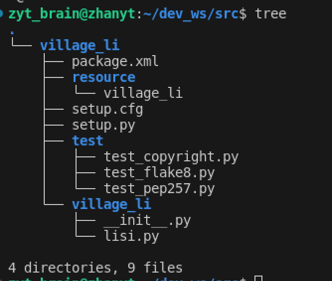

*ps.这里是按fishros的流程，与古月的不要混着来*

# 创建工作空间与功能包

因为节点需要存在于功能包中，功能包需要存在于工作空间中，所以要想创建节点，就应该先创建工作空间，再创建功能包

## 创建工作空间

工作空间就是文件夹，所以很简单：  （在home目录下）

```
mkdir -p dev_ws/src
cd dev_ws/
code ./             #在工作空间中打开vscode，后续操作在vscode中进行
```

ps.(!)如果是wsl也可以自行开启windows的vc打开远程链接，选择相应的文件夹（工作空间）

在vscode中右键src文件夹，选择“在集成终端中打开”(open in integrated terminal)，即可在vc中打开终端。其实这和ubuntu的终端是一样的，只是打开位置不同。

## 创建功能包

在src目录下，，建立一个名为village_li的功能包

```
ros2 pkg create village_li --build-type ament_python --dependencies rclpy
```

其中--dependencies是可选项，指这个功能包的依赖，这里给的是ros2的python客户端接口rclpy

创建后可以通过tree看到这样的目录


***tree不是ubuntu自带的，可以借助指令下载：***

```
sudo apt  install tree  # version 2.0.2-1
```


## 创建节点文件

在__init__.py同级别的目录下创建一个叫lisi.py的文件（用cmd或是直接在vc中右键创建均可）效果如图：




# 开始编写程序

**编写ros2节点的一般步骤**：

1. 导入库文件
2. 初始化客户端库
3. 新建节点
4. spin循环节点
5. 关闭客户端库

**几种编程思想：oop，pop**

## 使用非oop方法编写第一个节点并测试

### 在lisi.py文件中编写代码：

框架：：：

```
import rclpy
from rclpy.node import node    #一二两句即导入库文件（ros2&python接口库）

def main(args=None)
  
    rclpy.init(args=args)       #初始化客户端
    node=Node("lisi")           #新建一个节点(此处的起节点名即是后面用node list查询时会看到的)

    rclpy.spin(node)            #保持节点运行直到收到退出指令（ctrl+c）
    rclpy.shutdown()            #关闭rclpy
'''注意！node=Node("lisi")和spin(node)中的node都只是一个代称，具体要换成每个节点的名字，如lisi_node'''
```

```
#加入节点内容
import rclpy
from rclpy.node import node  

def main(args=None)
  
    rclpy.init(args=args)   
    lisi_node=Node("lisi")   
    lisi_node.get_logger().info("大家好，我是李四")   #填充节点内容，实现节点功能
    rclpy.spin(lisi_node)  
    rclpy.shutdown()  
```


### 配置

编写完成后，要想成功编译运行代码，还应进行一些配置，告诉ros2功能包，节点和入口函数的位置：

在功能包下的setup.py文件中的末尾有

```
entry_points={
        'console_scripts': [
        ],
    },
```

加入路径配置：

```
entry_points={
        'console_scripts': [
	    "lisi_node=village_li.lisi:main"
        ],
    },
```


### 编译

如果已经下载了colcon，则直接输入 `colcon build`

如果还没有：

```
sudo apt-get install python3-colcon-common-extensions 
colcon build
```
