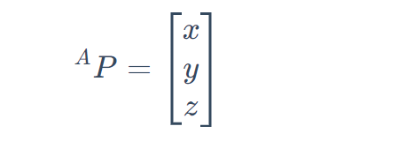
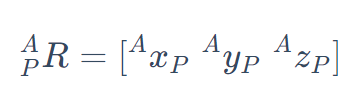
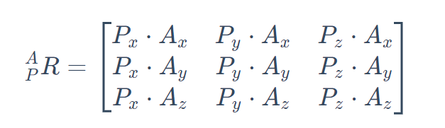

# 空间中物体的描述方法

描述一个物体在空间中的具体状态，需要物体的位置与姿态，简称位姿

# 数学表示

## 位置

位置的表示即物体在参考坐标系中xyz的坐标，由**位置矢量（即原点指向物体参考系原点的矢量）**

简单地说就是坐标(x,y,z)

## 姿态

即物体的坐标系相对于参考坐标系的朝向，用旋转矩阵表示

我们将坐标系{P}的三个轴相对于参考坐标系{A}三个轴的共九个角度的余弦值，组成一个3*3的矩阵，该矩阵就是旋转矩阵，因该矩阵是{P}相对于{A}的姿态关系的表示，故记作

（默认坐标轴是单位向量）

需要注意的是：

* 当两个坐标系之间姿态没有变化，即坐标系间轴方向对应重合，则旋转矩阵为单位矩阵
* 从矩阵的角度看，矩阵的逆等于矩阵的转置，则该矩阵为正交矩阵，显而易见，旋转矩阵的转置是正交矩阵
* P相对于A的旋转矩阵的转置是A相对于P的旋转矩阵
